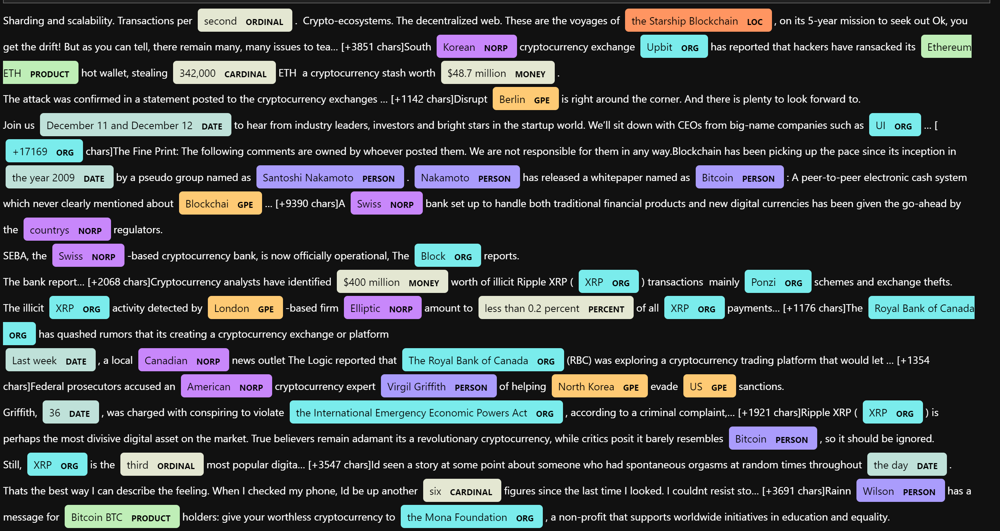

# Bitcoin and Ethereum public sentiment comparision

In this exercise, we look at news articles about Bitcoin and Ethereum and analyze the sentiments, most commonly used words and named entities.

Looking at the articles from NewsAPI, we see that both coins returned neutral scores.

Bitcoin does show a slightly higher positive mean score, compound score and poistive score

## Bitcoin Sentiment

## Ethereum Sentiment

- Bitcoin had a slight higher mean positive score of .0594 compared to Ethereum of 0.0593

- Ehtereum had the higher compound positive score of .098 compared to Bitcoin of 0.094

- Ethereum and Bitcoin seems to share the same sentiment.

The following displays the top 10 commonly used words

## Bitcoin Top 10

## Ethereum Top 10

The following shows the word cloud for Bitcoin and Ethereum

## Bitcoin Word Cloud

## Ethereum Word Cloud

The following shows entity visualization

## Bitcoin Entity Visuals

## Ehtereum Entity Visuals

